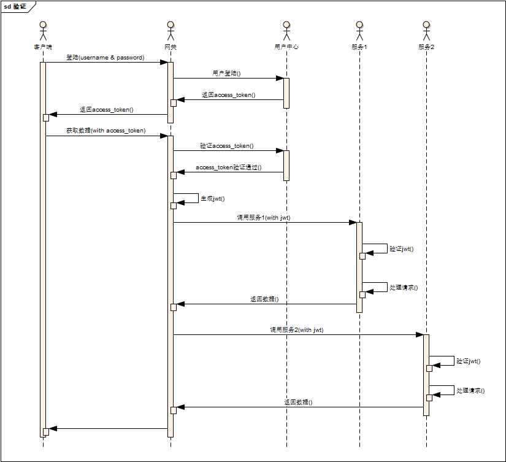

# yivgame
Yivgame是用go语言基于go-kit写的一套微服务架构游戏服务器方案，它不是一个框架，是一整套游戏服务器实例，每个模块只保留了一份示例代码实现。除了游戏服务器（长连接），还包含针对前端和后台运营的API接口服务器，运营后台的界面会使用Angular实现。
除了服务器本身之外，还会涉及docker部署的详细配置。

## 特性
* 微服务架构
* 客户端与游戏服务器通过 grpc 双向流(bidirectional streaming)实现透传
* 客户端与服务端websocket通信
* 实现 http endpoints 和 websocket endpoints 度量衡和日志
## 设计实践
* 实现游戏核心业务、用例、接口和设施分层模型（参考领域模型）
* 包采用单向依赖，外层可依赖内层，内层不可依赖外层（从外到内分别为：设施、接口、用例和业务），业务层仅依赖了标准库包
* 使用包偏平化布局
* 无全局变量，内层对基础设施的依赖通过接口定义，由外层实现，在创建时通过参数注入
## 模型
### 通信图

* 通信方式
  * HTTP：http为作短连接，主要用于后台运营系统的通信，另外，游戏中涉及到强交互的数据通信部分，也可以用http来通信
  * WebSocket：客户端使用cocos creator开发，长连接通信支持WebSocket，WebSocket主要用于游戏中实时和强交互的难通信
  * GRPC：基于HTTP/2协议GRPC，可以实现在一个socket连接上进行多stream通信，是go微服务生态中比较通用的通信方式
* 数据格式
  * JSON：由于json格式的自解释性，主要将它作在游戏中短连接和后台运营系统接口的数据交换
  * Protobuf：主要用于客户端与服务端websocket间和微务间的数据交换

### 服务组件图

* Agent：主要用于客户端的接入，它直接将数据报文透传、转发到后端微服务，是一个傻网关、薄网关，几乎不参与业务逻辑和编解码业务数据，所以其代码逻辑相对简单，也极易进行水平扩展
* UserCenter：所有玩家数据集中在 user center 进行管理，由 user center 负责游戏数据的读写删改查，它提供grpc接口供apigate、game server等其它需要请求玩家数据微服务使用
* Game Server：主要负责游戏业务逻辑的处理
### 身份认证与鉴权

* 服务与服务之间使用jwt进行身份认证
* 通过API gateway实现单点登陆
* 全局认证，每服务鉴权（do authentication globally, and authorization in every microservice）
## 设施依赖
* docker：所有依赖设施服务和游戏实例通过docker社区版进行布署
* rockcoach：作为持久化数据库
* kafka：作为message queue和stream platform
* etcd：用于服务发现
* gogs：使用gogs进行版本管理
* drone：用于实现持续集成
* bind9：域名服务器，通过切换域名解析实现开发、测试网络的无缝切换
## go-kit generator
* [yiv/gk](https://github.com/yiv/gk): go-kit 代码生成器是一把手电钻，go-kit目前发现的唯一的不爽就是写一个服务太啰嗦，它设计了一套很优雅的服务输出方式，但为了写一个服务接口，每个都要写一整套endpoint、set和transport，代码模式都是相同的，这一大坨大坨的代码基本相似，手写得多了就会很烦燥，感觉在做重复的工作，打了几遍都没有发现完全符合go-kit官方实便的generator，最后选中了[kujtimiihoxha/gk](https://github.com/kujtimiihoxha/gk)，但它还没有很多地方并不完善，也不完全适用于我，于是fork下来自己改，通过它自动生成代码，在写服务接口的时候可以美减少60%的重复代码，更重要的是，它极大地降低了出错的概率。

## 系统环境
* Ubuntu Server 16.04

## 参考
* [gonet/2](https://gonet2.github.io/): yivgame从gonet吸取了很多设计，如使用stream进行透传、引入kafka等
* [go-kit](https://github.com/go-kit/kit): yivgame基于go-kit开发
* [goddd](https://github.com/marcusolsson/goddd): 一个用go写的基于领域模型的样例APP
* [Practical Persistence in Go: Organising Database Access](http://www.alexedwards.net/blog/organising-database-access)
* [The Clean Architecture](https://8thlight.com/blog/uncle-bob/2012/08/13/the-clean-architecture.html)
* [Applying The Clean Architecture to Go applications](http://manuel.kiessling.net/2012/09/28/applying-the-clean-architecture-to-go-applications/)
