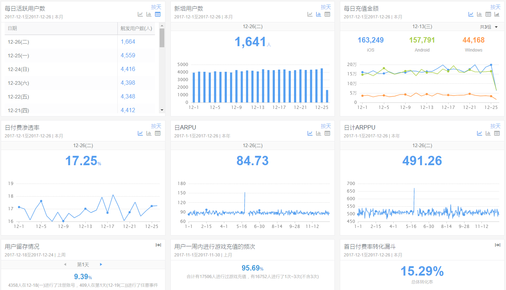

# yivgame
Yivgame是用go语言基于go-kit写的一套微服务架构游戏服务器方案，它不是一个框架，是一整套游戏服务器实例，每个模块只保留了一份示例代码实现。除了游戏服务器（长连接），还包含针对前端和后台运营的API接口服务器，运营后台的界面会使用Angular实现。
除了服务器本身之外，还会涉及docker部署的详细配置。

## 特性
* 微服务架构
* 客户端与游戏服务器通过 grpc 双向流(bidirectional streaming)实现透传
* 客户端与服务端websocket通信
* 实现 http endpoints 和 websocket endpoints 度量衡和日志
## 设计实践
### 微服务架构
* 通过微服务架构，将传统的游戏服务器拆分成了不同的微服务
* 不同的微服务器可通过grpc进行同步通信和通过kafka进行异步通信
### 领域驱动模型
* 为了实现软件不同层次的解耦，各服务统一都参照领域驱动模型进行设计
* 将微服务的软件结构由内至外分成游戏领域业务层、用例层、接口层和设施依赖层
* 各层之间严格遵守由外向内的单向依赖

业务层主要实现游戏或服务器的是核心逻辑，不关心外部实现，对文件系统、数据库等的依赖，业务层使用interface定义接口，由依赖层实现接口方法，并在main中通过依赖注入的方式传递给业务层调用。所以业务层除了引用一些基本的标准库外，几乎不引用第三方包。
### 事件驱动模型与Kafka
* 整个微服务系统之间的核心通信方式是grpc同步调用和以kafka作为流平台的异步事件通信
* 所有微服务内的被关注的活动都会以产生事件的方式发布到kafka，具有不同关注点的消费者分别订阅各自感兴趣的事件，kafka将事件推送给消费者，消费者做相以的事件处理和响应
### 事件驱动模型与数据分析
* 以前做游戏数据分析的时候，都是通过联表查询
* 使用事件驱动模型后，可把我们关注的玩家行为都作为事件记录下来，为不同的事件设计不同的属性，实现极具扩展性的数据分析
### 工程目录结构
* 由于由于go-kit实现的微服务架构，所以在目录结构上尽量与go-kit的官方示例保持一致
* 由于领域驱动模型是分层的，所以在设计工程目录结构的时候很自然的会把内层包的目录包含在外层内，由于我比较喜欢大多数go工程的偏平目录结构，所以没有严格按着领域层次来设计目录结构，反而是把不同层次包的目录放在了同级的目录下面，对我来说，这样显得直观、简单一些

### 无全局变量
* 为了让软件在代码逻辑上面更加清晰，严格避免全局变量
### 数据缓存、数据存盘与Kafka
* 所以玩家数据直接保存在服务内存中，便于直接进行数据处理
* 玩家数据的修改通过WAL方式写入kafka，再由存盘服务异步地写入数据库
* 由于使用了WAL方式，则玩家数据的redo和undo则很容易实现
### NewSQL CockroachDB
* 数据持久化使用支持分布式事务的关系数据库CockroachDB
* 使用CockroachDB可以很轻松的实现水平扩展、故障容错和自动恢复、负载均衡

我从v1.0开始使用CockroachDB，从v1.0到v1.0.6，CockroachDB在特定情况和压力下，一直存在崩溃的问题，自从v1.1发布，崩溃问题没再出现，但是性能一直没有大的改善。因为yivgame的数据几乎都存在内存中，只有存盘的时候需要写db，所以对整个yivgame系统来说，不存在db性能瓶颈。
## 模型
### 通信图

* 通信方式
  * HTTP：http为作短连接，主要用于后台运营系统的通信，另外，游戏中涉及到强交互的数据通信部分，也可以用http来通信
  * WebSocket：客户端使用cocos creator开发，长连接通信支持WebSocket，WebSocket主要用于游戏中实时和强交互的难通信
  * GRPC：基于HTTP/2协议GRPC，可以实现在一个socket连接上进行多stream通信，是go微服务生态中比较通用的通信方式
* 数据格式
  * JSON：由于json格式的自解释性，主要将它作在游戏中短连接和后台运营系统接口的数据交换
  * Protobuf：主要用于客户端与服务端websocket间和微务间的数据交换

### 服务组件图

* Agent：主要用于客户端的接入，它直接将数据报文透传、转发到后端微服务，是一个傻网关、薄网关，几乎不参与业务逻辑和编解码业务数据，所以其代码逻辑相对简单，也极易进行水平扩展
* UserCenter：所有玩家数据集中在 user center 进行管理，由 user center 负责游戏数据的读写删改查，它提供grpc接口供apigate、game server等其它需要请求玩家数据微服务使用
* Game Server：主要负责游戏业务逻辑的处理
### 身份认证与鉴权

* 服务与服务之间使用jwt进行身份认证
* 通过API gateway实现单点登陆
* 全局认证，每服务鉴权（do authentication globally, and authorization in every microservice）
## 设施依赖
* docker：所有依赖设施服务和游戏实例通过docker社区版进行布署
* rockcoach：作为持久化数据库
* kafka：作为message queue和stream platform
* etcd：用于服务发现
* gogs：使用gogs进行版本管理
* bind9：域名服务器，通过切换域名解析实现开发、测试网络的无缝切换
## go-kit generator
* [yiv/gk](https://github.com/yiv/gk): go-kit 代码生成器是一把手电钻，go-kit目前发现的唯一的不爽就是写一个服务太啰嗦，它设计了一套很优雅的服务输出方式，但为了写一个服务接口，每个都要写一整套endpoint、set和transport，代码模式都是相同的，这一大坨大坨的代码基本相似，写多了就会很烦燥，感觉在做重复的工作，而且极易出错，找了几遍都没有发现完全符合go-kit官方示例的generator，最后选中了[kujtimiihoxha/gk](https://github.com/kujtimiihoxha/gk)，但它还没有很多地方并不完善，也不完全适用于我，于是fork下来自己改，通过它自动生成代码，在写服务接口的时候可以美减少60%的重复代码，更重要的是，它极大地降低了出错的概率。

## 系统环境
* Ubuntu Server 16.04

## 参考
* [gonet/2](https://gonet2.github.io/): yivgame从gonet吸取了很多设计，如使用stream进行透传、引入kafka等
* [go-kit](https://github.com/go-kit/kit): yivgame基于go-kit开发
* [goddd](https://github.com/marcusolsson/goddd): 一个用go写的基于领域模型的样例APP
* [Practical Persistence in Go: Organising Database Access](http://www.alexedwards.net/blog/organising-database-access)
* [The Clean Architecture](https://8thlight.com/blog/uncle-bob/2012/08/13/the-clean-architecture.html)
* [Applying The Clean Architecture to Go applications](http://manuel.kiessling.net/2012/09/28/applying-the-clean-architecture-to-go-applications/)
